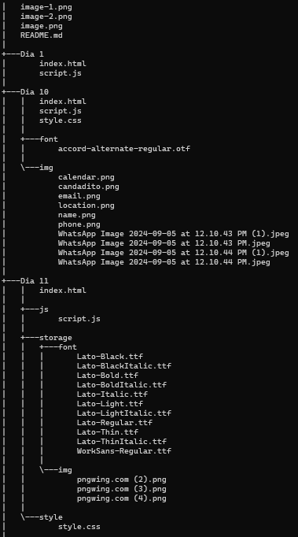
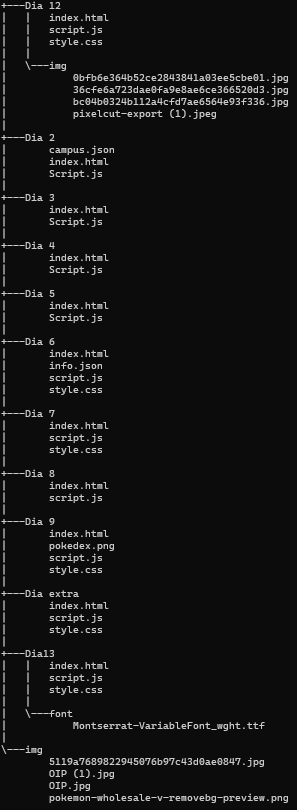

# JavaScript

## Descripción

Este repositorio se encuentra organizado en carpetas por días, donde estas contienen documentos con las explicaciones de los temas en clase y la realización de los ejercicios asignados.

## Tecnologías utilizadas

|JavaScript|HTML5|CSS3|Json|
|-|-|-|-|
|||||

## Estructura

|||
|-|-|

## Características
|Nombre|Descripción|
|-|-|
|Archivos **index**|Estos son los archivos que contienen la parte de la estructura para el aplicativo.|
|Archivos **Style**|Estos archivos contienen el diseño y son los que dan el color y atractivo a dichos aplicativos.|
|Archivos **Script**|Estos archivos contienen el código para darle funcionalidad a los aplicativos realizados.|
|Carpetas **img**|Contienen las imágenes utilizadas para mejorar la visualización de los aplicativos.|
|Carpetas **font**|Contienen los tipos de letras utilizados en cada aplicativo.|

## Instrucciones

**1.** Clonar el repositorio cargardo en GitHub.

**2.** Abrir una de las carpetas que están organizadas por días.

**3.** Abrir y ejecutar el archivo **[index.html]**.

## Desarrollado por
Los trabajos fueron realizados por Alejandra Machuca, estudiante de CampusLands.